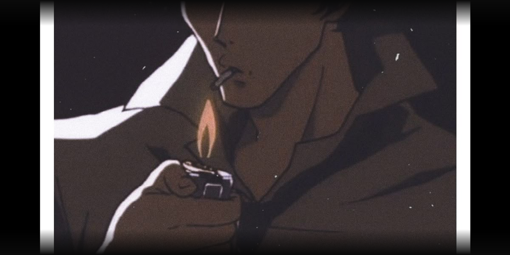

  
  
  

---

### `> about`

CS Morocco. Cybersecurity track.
Building tools, breaking things, learning everything.
AI on the side.

### `> currently`

- Building everything and anything
- Prepping something big ... just wait

### `> stack`

  

### `> stats`

  

### `> contribution graph`

<picture>
  <source media="(prefers-color-scheme: dark)" srcset="https://raw.githubusercontent.com/Platane/snk/output/github-contribution-grid-snake-dark.svg" />
  
</picture>

&gt; sudo access denied HAHAHA

 

